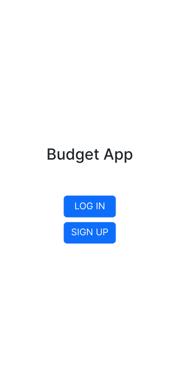
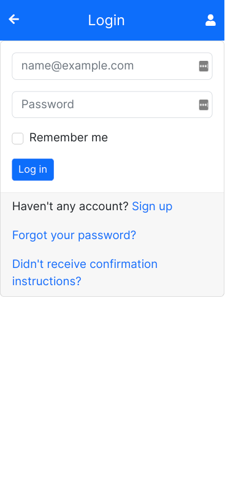
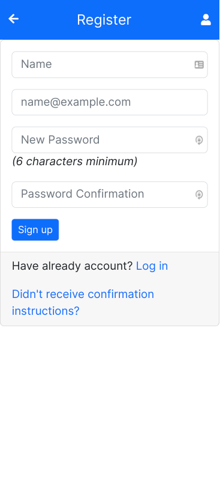
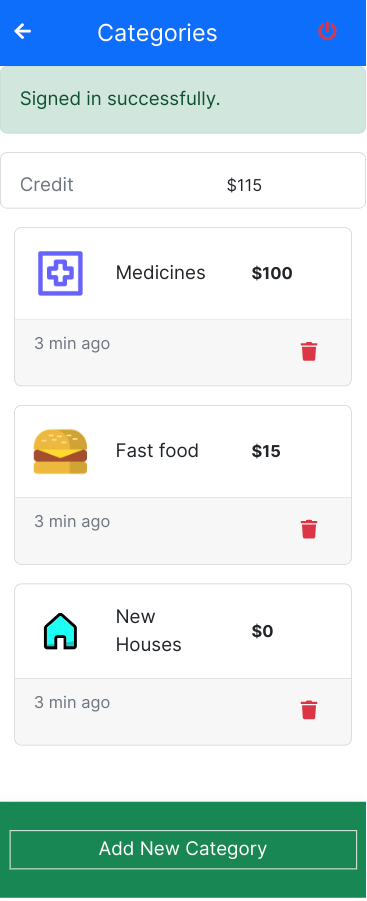
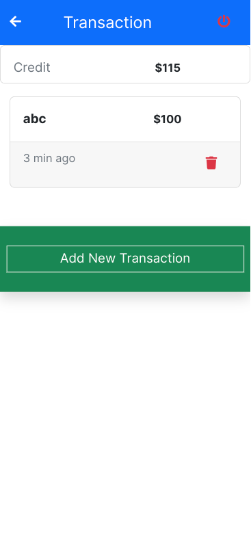

<a name="readme-top"></a>

<!-- TABLE OF CONTENTS -->

# 📗 Table of Contents

- [📗 Table of Contents](#-table-of-contents)
- [📖 Budget App ](#-budget-app-)
  - [🛠 Built With ](#-built-with-)
    - [Full Stack ](#full-stack-)
    - [Key Features ](#key-features-)
  - [:camera: Screen Shots](#camera-screen-shots)
  - [:movie\_camera: Video documentation](#movie_camera-video-documentation)
  - [🚀 Live Demo ](#-live-demo-)
  - [💻 Getting Started ](#-getting-started-)
    - [Prerequisites](#prerequisites)
    - [Setup](#setup)
    - [Install](#install)
    - [Usage](#usage)
    - [Run tests](#run-tests)
  - [👥 Authors ](#-authors-)
  - [🔭 Future Features ](#-future-features-)
  - [🤝 Contributing ](#-contributing-)
  - [⭐️ Show your support ](#️-show-your-support-)
  - [❓ FAQ ](#-faq-)
  - [� Acknowledgments ](#-acknowledgments-)
  - [📝 License ](#-license-)

<!-- PROJECT DESCRIPTION -->

# 📖 Budget App <a name="about-project"></a>

> This is a budget app where you can setup your different budgets and you can create different categories and also delete your own categories and also create new transactions and also delete your own transactions.

## 🛠 Built With <a name="built-with"></a>

### Full Stack <a name="tech-stack"></a>

> I am using full stack technologies to build my project.

<details>
  <summary>Client</summary>
  <ul>
    <li><a href="https://github.com/jeremyevans/erubi">ERB</a></li>
  </ul>
</details>

<details>
  <summary>Server</summary>
  <ul>
    <li><a href="https://rubyonrails.org/">Ruby On Rails</a></li>
  </ul>
</details>

<details>
<summary>Database</summary>
  <ul>
    <li><a href="https://www.postgresql.org/">PostgreSQL</a></li>
  </ul>
</details>

<!-- Features -->

### Key Features <a name="key-features"></a>

> Key features of the application.

- **Login Functionality**
- **Add new category**
- **Delete your own categories**
- **Add new transaction**
- **Delete your own transactions**

<p align="right">(<a href="#readme-top">back to top</a>)</p>

<!-- Screen Shots -->

## :camera: Screen Shots

<details>
<summary>Screen Shots</summary>





</details>

<!-- Video -->
## :movie_camera: Video documentation
[video](https://drive.google.com/file/d/1J3jDFveZznVjx5uZs9z9lN_yW7bPMWUU/view?usp=sharing)

<!-- LIVE DEMO -->

## 🚀 Live Demo <a name="live-demo"></a>

- [Live Demo Link](https://my-budget-app.herokuapp.com/)

<p align="right">(<a href="#readme-top">back to top</a>)</p>

<!-- GETTING STARTED -->

## 💻 Getting Started <a name="getting-started"></a>

> To get a local copy up and running, follow these steps.

### Prerequisites

In order to run this project you need:

command:

```sh
 gem install rails
```

### Setup

Clone this repository to your desired folder:

commands:

```sh
  git clone git@github.com:aamirkhan2478/budget-app.git
```

### Install

Install this project with:

command:

```sh
  cd budget-app
  gem install
```

### Usage

To run the project, execute the following command:

command:

```sh
  rails s
```

### Run tests

To run tests, run the following command:

command:

```sh
  rspec
```

<p align="right">(<a href="#readme-top">back to top</a>)</p>

<!-- AUTHORS -->

## 👥 Authors <a name="authors"></a>

> The collaborators of this project.

👤 **Aamir Khan**

- GitHub: [@aamirkhan2478](https://github.com/aamirkhan2478)
- LinkedIn: [LinkedIn](https://linkedin.com/in/aamir-kh)

<p align="right">(<a href="#readme-top">back to top</a>)</p>

<!-- FUTURE FEATURES -->

## 🔭 Future Features <a name="future-features"></a>

> Features of this project.

- [ ] **Add time functionality**

<p align="right">(<a href="#readme-top">back to top</a>)</p>

<!-- CONTRIBUTING -->

## 🤝 Contributing <a name="contributing"></a>

Contributions, issues, and feature requests are welcome!

Feel free to check the [issues page](https://github.com/aamirkhan2478/my-blog/issues).

<p align="right">(<a href="#readme-top">back to top</a>)</p>

<!-- SUPPORT -->

## ⭐️ Show your support <a name="support"></a>

> If you like this project then you can show your support by giving to this project star.

<p align="right">(<a href="#readme-top">back to top</a>)</p>

<!-- FAQ (optional) -->

## ❓ FAQ <a name="faq"></a>

> Questions for new developers would ask when they decide to use your project.

- **How I can run this project?**

  - After cloning repository, run rails s. After that, you will see you will see the homepage of the project.

- **How I can install rails**

  - Install the rails by using `gem install rails`.

<p align="right">(<a href="#readme-top">back to top</a>)</p>

<!-- ACKNOWLEDGEMENTS -->

## 🙏 Acknowledgments <a name="acknowledgements"></a>


Original design idea by [Gregoire Vella on Behance](https://www.behance.net/gregoirevella).

<p align="right">(<a href="#readme-top">back to top</a>)</p> 
<!-- LICENSE -->

## 📝 License <a name="license"></a>

This project is [MIT](./MIT.md) licensed.

<p align="right">(<a href="#readme-top">back to top</a>)</p>
